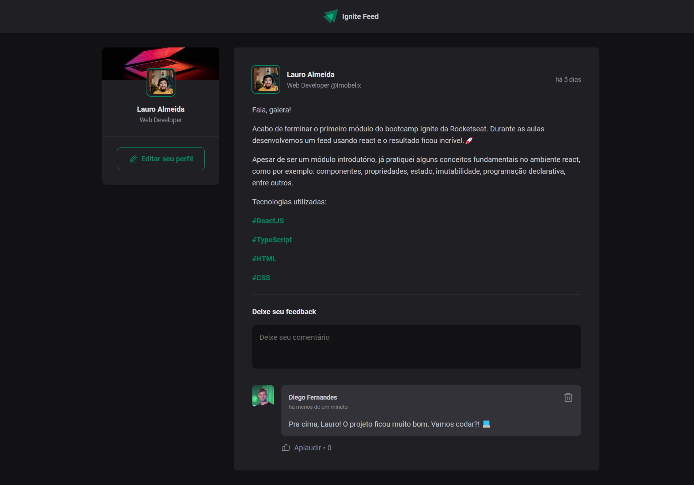

# Ignite feed - Bootcamp Ignite - RocketSeat

> Fundamentos do ReactJS - Trilha 2022

Projeto implementado durante o primeiro módulo do bootcamp Ignite.

[🔗 Clique aqui para acessar](https://lauro-almeida.github.io/ignite-feed/)

## 🔧 Tecnologias
- ReactJS
- HTML
- CSS
- Git e Github
- Vite

## ✉️ Contato
lauro.almeida@uniriotec.br
